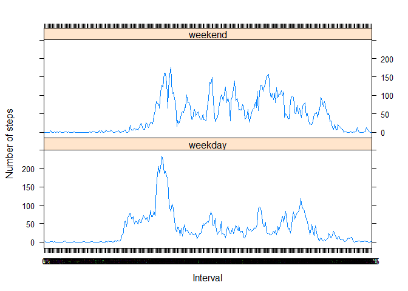

# Reproducible Research: Peer Assessment 1


## Loading and preprocessing the data
This assumes the activity.csv file is in the current working directory. This will convert the date column to date type.

```r
data<- read.csv("activity.csv", header=T, sep=',', colClasses=c("numeric", "character", "numeric")) 
library(ggplot2)
```

```
## Warning: package 'ggplot2' was built under R version 3.2.3
```

```r
data$date <- as.Date(data$date, format = "%Y-%m-%d")
data$interval <- as.factor(data$interval)
head(data)
```

```
##   steps       date interval
## 1    NA 2012-10-01        0
## 2    NA 2012-10-01        5
## 3    NA 2012-10-01       10
## 4    NA 2012-10-01       15
## 5    NA 2012-10-01       20
## 6    NA 2012-10-01       25
```

```r
str(data)
```

```
## 'data.frame':	17568 obs. of  3 variables:
##  $ steps   : num  NA NA NA NA NA NA NA NA NA NA ...
##  $ date    : Date, format: "2012-10-01" "2012-10-01" ...
##  $ interval: Factor w/ 288 levels "0","5","10","15",..: 1 2 3 4 5 6 7 8 9 10 ...
```


## What is mean total number of steps taken per day?
First, I will aggregate the data to get the sum of steps per date. I am removing NA values.  

```r
data1 <- aggregate(steps ~ date, data, sum, na.rm = TRUE)
head(data1)
```

```
##         date steps
## 1 2012-10-02   126
## 2 2012-10-03 11352
## 3 2012-10-04 12116
## 4 2012-10-05 13294
## 5 2012-10-06 15420
## 6 2012-10-07 11015
```
I will then use the ggplot function to create a histogram.

```r
ggplot(data1, aes(x = steps)) + 
  geom_histogram(fill = "blue", binwidth = 500) + 
  labs(title="Steps Taken per Day", 
       x = "Total Number of Steps per Day", y = "Frequency (number of times completed)")
```


Finally, I will computer the mean and median of the total number of steps.

```r
mean_data1 <- mean(data1$steps)
med_data1 <- median(data1$steps)
mean_data1
```

```
## [1] 10766.19
```

```r
med_data1
```

```
## [1] 10765
```
## What is the average daily activity pattern?
First, I will aggregate the data using the mean of steps over the intervals. 

```r
data2 <- aggregate(steps ~ interval, data, mean, na.rm=TRUE)
head(data2)
```

```
##   interval     steps
## 1        0 1.7169811
## 2        5 0.3396226
## 3       10 0.1320755
## 4       15 0.1509434
## 5       20 0.0754717
## 6       25 2.0943396
```
I will then use the plot function to plot the average number of steps over the intervals.

```r
plot(data2$steps, type = "l", main = "Average Number of steps taken per time interval", ylab = "Average number of steps", xlab = "Time Interval")
```


Here I will determine the the interval with the max number of steps:

```r
data2[which.max(data2$steps),]
```

```
##     interval    steps
## 104      835 206.1698
```
## Imputing missing values
First, I will find the number of NA values

```r
total <- sum(is.na(data))
total
```

```
## [1] 2304
```
Then I will aggregate the data using the mean function. I will rename the columns of the new dataset (mean_data)

```r
mean_data <- aggregate(steps ~ interval, data, mean)
colnames(mean_data) <- c("interval", "mean_steps")
```
I will now merge the data with the new dataset created above. 

```r
data3 <- merge(data, mean_data)
```
Next, I will create a new column and if steps is NA, fill in the new column with the corresponding mean step value. Otherwise, fill it in with the current step value.

```r
data3$updated_steps <- ifelse(is.na(data3$steps), 
                                  data3$mean_steps, data3$steps)
```
I will aggregate the new dataset using the updated_Steps column and the sum function

```r
data4 <- aggregate(updated_steps ~ date, data3, sum)
head(data4)
```

```
##         date updated_steps
## 1 2012-10-01      10766.19
## 2 2012-10-02        126.00
## 3 2012-10-03      11352.00
## 4 2012-10-04      12116.00
## 5 2012-10-05      13294.00
## 6 2012-10-06      15420.00
```
Here, I will create the histogram

```r
ggplot(data4, aes(x = updated_steps)) + 
  geom_histogram(fill = "green", binwidth = 500) + 
  labs(title="Steps Taken per Day", 
       x = "Total Number of Steps per Day (NAs filled in)", y = "Frequency (number of times completed)")
```


Finally, I will compute the mean and median of the new dataset

```r
mean_data4 <- mean(data4$updated_steps)
med_data4 <- median(data4$updated_steps)
mean_data4
```

```
## [1] 10766.19
```

```r
med_data4
```

```
## [1] 10766.19
```
These numbers are very close to the original dataset but they are slightly different. The median is the value that has increased with the new dataset.
## Are there differences in activity patterns between weekdays and weekends?
First I will create a character vector from the known dates in the data set

```r
weekday <- tolower(weekdays(data3$date))
```
Create a new column that displays the type of day using if else function

```r
data3$type_of_day <- as.factor(ifelse(weekday == "saturday" | weekday == "sunday", 
                                     "weekend", "weekday"))
```
Aggregate the data using the mean. Be sure to keep the type of day column!

```r
data5 <- aggregate(steps ~ interval + type_of_day, data3, mean)
```
Load the lattice package. Use xyplot to generate two graphs, one for weekends and one for weekdays.

```r
library(lattice)
xyplot(steps ~ interval | type_of_day, data5, type = "l", layout = c(1, 2), 
       xlab = "Interval", ylab = "Number of steps" )
```


